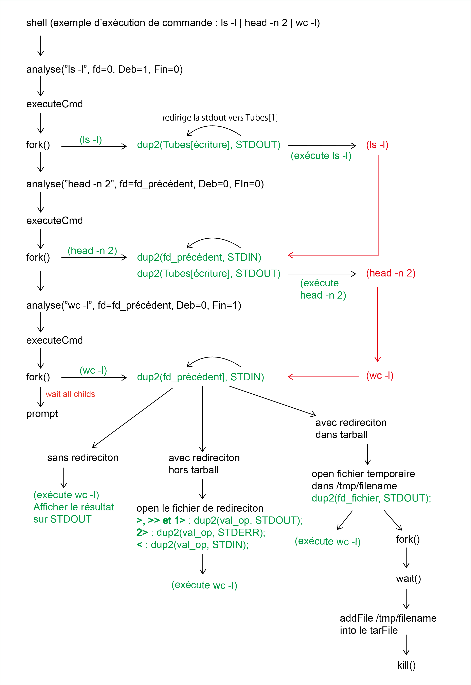

Systèmes L3 2020-2021
======================

**L'équipe 6 : MECHOUAR Fella / SU LiFang / BADJI Sidy**

# Final Rendu projet

## Branche : master, Tag : soutenace

### 0 Repartition du travail 
    MECHOUAR Fella 
        - fonctions permettant l'ajout d'un fichier / repertoire  externe dans un tarball ( dans le fichier sgf.c )
        - fonctions permettant l'ajout d'un reprtoire /fichier d'un tarball dans un repertoire exterieur ( dans le fichier sgf.c )
        - fonctions assurant la copie des fichiers ou repertoires entre les tarballs  ( dans le fichier sgf.c )
        - analyse syntaxique 
        - la commande ls -l
        - la commande cp, mv
        - la commande mkdir
        
    SU LiFang
         - La structure core du shell 
         - La gestion des pipe et des sous commandes par des process fils
         - L'utilisation de l'ensemble des commandes externes
         - Les fonctions pour afficher les fichiers et les répertroires pour la gestion des fichiers tarballs (Collabore avec Mechouar Fella)
         - La gestion des commandes cd (totalement redefinie), mais aussi ls, cat, pwd (redefinies uniquement lorsque des tarball sont en jeu)
         - Les commandes de redirection hors tar : >, >>, <, et 1>, 2>(stderr)
         - Les commandes de redirection dans les tar : > , 2> (Collabore avec Mechouar Fella)
        
    BADJI Sidy
        - les fonctions pour supprimer fichier et repertoire dans le fichier .tar
        - les foncitons de suppression : rm, rmdir, rm -r
        - Dockerfile

### 1 Introduction
#### Fonctionnement du Shell
Vous pouvez trouver ces  foncitons dans le fichier sgf.c et shell.c. Tous les tests sont effetués sur antiX.

* Le shell tsh est fait d'un prompt mis dans une boucle infinie, attendant une commande jusqu'a l'écriture de la commande "exit" par l'utilsateur.

* Ce prompt est composé par une variable interne au shell nommée pwd , représentant le répertoire courant lors de l'execution du programme, par exemple :  /home/user/VB/Shell$>

* Cette pwd évoluera par la suite , et est différent du PWD systeme lors des passages dans les fichiers tar. On peut changer de répertoire via la commande "cd" qui a été entièrement  recodée, avec une légère modification : lors d'un appel cd sur un fichier tar, on simule une entrée dans ce fichier tar, en updatant le prompt de facon appropriée. Par la suite, on peut faire de nouveaux cd sur les différents répertoires le composant.  La commande "cd .." permet de remonter d'un niveau, même si on se trouve dans un fichier tar.

* La commande recue sur le prompt est ensuite découpée à chaque "pipe" afin de séparer les sous-commandes la composant, par exemple : la commande "ls -l | head -n 2 | wc -l " sera découpée en 3 parties. 

* Chaque sous commande est analysée via la fonction analyse( ) ou la sous commande est envoyée avec le fichier descripteur du processus précédent, et des variables indiquant si la commande est la premiere, au milieu, ou la derniere d'une chaine, par exemple : la commande "ls -l | head -n 2 | wc -l ", pour la premiere partie de commande "ls -l" sera la premiere, "head -n 2" sera au milieu et "wc -l" sera la derniere. 

* Lors de l'analyse, chaque sous commande est découpée dans un tableau d'arguments arguments comprenant dans notre cas "ls" "-l", dans cette table, args[0] = "ls", args[1] = "-l". (cf. void decoupe(char* cmd) ) 

* Si la sous commmande est reconnue comme une commande totalement redefinie dans le shell ( ex : cd ), les commandes seront executées par le code de fonctions spécifiques, sinon les fonctions seront considérées comme des fonctions externes ou redefinies sous condition et executées via la fonction executeCmd qui sera chargée de ce nouveau tri. Par exemple, la commande "ls",  on peut l'executer comme "ls" hors des tarballs (commande standard) , soit on l'execute comme une commande spécifique pour afficher les contenus d'un fichier tar. (cf. ls2 dans shell.c)

* Chaque sous commande fork un processus l'executant.
    - La premiere sous commande crée un process qui  comprend un tube en sortie vers le process suivant.
    - Les sous commandes centrales crée un process qui comprennent un tube en entrée depuis le process précédent, ainsi qu'un tube en sortie vers le process suivant.
    - La derniere sous commande crée un process qui comprend uniquement un tube en entrée depuis le process précédent.
    - Sur l'exemple , le shell crée un process child afin d'executer "wc -l", qui écoute le retour du process child executant " head -n 2 ", qui écoute lui-meme le retour du process executant le "ls -l"
      si le "ls -l" se fait dans un tarball , ou a pour argument un tarball, la fonction redéfinie sera appelée et envérra son résultat au process suivant.

                    fork1         fork2             fork3 (C'est le shell qui fait les forks)
            Shell <------- wc -l <------ head -n 2 <------ ls -l

### 2 Installation
#### Comment installer sur antiX (en root)
    - mettre à jour la date et l'heure sur antiX avec la commande root /usr/local/bin/set_time-and_date.sh
    - si besoin utiliser la commande "setxkbmap fr" afin de mettre le clavier en azerty
    - package a installer : gcc, manpages-dev et rlwarp

        apt update  //pour mettre a jour la liste des packages 
        apt install build essential //pour installer gcc
        apt install rlwrap //pour installer rlwrap
        apt-get install manpages-dev // pour mettre le man a jour
        
    - Le programme se compile via make, un Makefile étant présent afin de compiler les sources. Cela crée un unique binaire executable : shell 
        make clean
        make
    - le shell s'execute ainsi : 
        rlwrap ./shell
    - Un mode debug est aussi disponible via l'ajout de l'argument "-debug"
        rlwrap ./shell -debug
        
    - l'utilitaire rlwrap permettant l'utilisation des fleches du haut et bas afin de rappeler les commandes précédentes du shell.
        
 #### Comment installer sur Docker
    - dockerfile :
         sudo docker run -it ubuntu bash -> pour installer l'image de ubuntu
         sudo docker container ls -> pour lister les container 
         sudo docker image ls -> pour lister les differentes images installer sur votre ordi
         sudo docker exec -it container /bin/bash -> pour l'executter en /bin/bash
         sudo docker start container -> pour lancer l'image correspondant au container
         sudo docker stop container -> pour l'arreter
         sudo docker rmi NomImage -> pour supprimer l'image 
         sudo docker rm container -> pour supprimer l'image au cas ou y'a un container en marche.

    - package installé :
         Il faut tout d'abord creer un fichier contenant l'algorithme permettant de creer l'image et les fichiers a exécuté
                Exemple Algorithme:
                        FROM alpine:latest 
                        RUN apk update
                        RUN apk add libc-dev
                        RUN apk add gcc
                        RUN mkdir /home/TestForDocker1
                        COPY test.c /home/TestForDocker1/test.c

         pour creer une nouvelle image avec le dockerfile que nous avons créé il faut :

            sudo docker build -t nomNewImage ./

        pour lancer cette image :

            sudo docker run -ti nomNewImage
    
### 3 Structure du shell ---> shell.c
#### Rôle de chaque fonction
* int analyse(char* cmd, int fd, int debut, int dernier) 
    - permet d'analyser une sous commande précise, la découpe via decoupe(cmd) et identifie les sous commandes qui sont totalement reefinies et nécéssitant pas de fork() (ex : cd , exit)
    - si la commande n'est pas totalement redefinie, fait appel a executeCmd

 * void cd(char *chemin)
    - utilise dans tous les cas la redefinition de la commande cd , qui permet la mise a jour du pwd local
 
* void decoupe(char* cmd) 
    - permet de remplir le tableau "arguments" avec la fonction decoupe(cmd). ls -l devient arguments[0] = "ls" , arguments[1] = "-l"

* int executeCmd(int fd, int debut, int dernier) 
    - Fork un fils, et redirige correctement les entrées et sorties des différentes sous-commandes selon leur position dans la commande initiale 
    - Selon la commande executée, on peut faire appel a des commandes redéfinies si un tarball est en jeu, sinon on execute directement la commande via execvp
 
* int UseRedefCmd()
    - Détecte si un tarball est en jeu dans le pwd actuel ou les arguments de la commande
 
* int rmdir_redefini() 
    - Commande agissant sur un tarball pour le suppression de repertoire

* int rm_redefini()  
    - Commande agissant sur un  tarball pour la suppression de fichier 

* int cp_redefinir()  
    - analyse les arguments de la commande et assure l'execution du bon code la commande cp

* int mkdir_redefini()  
    - analyse les arguments de la commande et assure l'execution du bon code de la commande mkdir

* int mv_redefini()  
    - analyse les arguments de la commande et assure l'execution  du bon code de la commande mv

* int cat_redefini() 
    -  Version redéfinie de cat appelée sur les tarballs afin de visualiser le contenu des fichiers présents a l'intérieur 

* int ls_redefini() 
    - Version redéfinie de ls appelée sur les tarballs afin de visualiser le contenu de leur arborescence par rapport au pwd actuel
    - l'option -l existe pour cette commande afin de visualiser les droits des fichiers
 
* char* convertChemin(char* chemin, char* charfinal)
    - Converti un chemin relatif en absolu

* char* removePointPoint(char* NewChemin , char* begin)
    - Supprime le ".." d'un chemin , ainsi que la sous partie qui le précède

* char* findGoodPath() 
    - Detecte le chemin contenant le ".tar" a utiliser
  
* void decoupePwdtmp()
    - Permet d'identifier le nom du tarname en jeu ainsi que son arborescence, si elle existe
 
* char* getTarParentDir(char*chemin) 
    - Permet d'extraire le répertoire parent d'un chemin incluant un fichier tarball

* char* getTarPath(char*chemin) 
    - Permet d'extraire le chemin complet d'un tar a partir d'un chemin incluant un fichier tarball

* char* getTarArbo(char*chemin) 
    - Permet d'extraire l'arborescence d'un tar a partir d'un chemin incluant un fichier tarball

* char* getTmpFileName(char*chemin)
    - Permet de resortir le nom final d'un fichier sur un chemin incluant un tarball, et y ajoute au préalable "/tmp/".
    - Utilisé pour la redirection dans un tar

 * char* removeSpace(char* str)
    - Supprime les espaces multiples dans la commande
 
* void attenteDuPere(int n)
    - Permet au Shell d'attendre le retour de tous ses fils avant de continuer

#### Redirections
* Les redirections se font dans un premier temps dans la fonction decoupe, qui initialise une variable "redirection" ainsi qu'un flag redirFlag lorsqu'une redirection est détéctée, et supprime la partie redirection de la commande finale (ex : "free > test" devient "free" mais a initialisé les variables et redirFlag.

* Sur le process final de la commande arrivant dans executeCmd, si une redirection est initialisée , le fichier demandé sera ouvert, et un dup2 de la sortie, de l'entrée ou de stderr sera initialisé selon le type de redirection demandé

* Pour les redirections dans les tarballs, un fichier temporaire est créé dans /tmp , puis sera recopié par un nouveau fork dans le tarball à l'emplacement souhaité. 

* Dans ce cas le petit fils créé par le fils executant la derniere partie de la commande attend qu'il ai terminé l'execution de sa commande (et de mourir) pour prendre la main et procéder a la recopie de l'ensemble du résultat.

#### Schéma de la structure du shell

### 4 Gestion des fichiers tarball ---> sgf.c
Les fonctions qui permettent l'ajout d'un fichier / repertoire externe dans un tarball
* char * fileToBlocks( int fd , char * filename , int * nb_blocks)
    - Cette fonction effectue la transformation du fichier pointé par le descripteur fd en un ensemble de blocks des taille de 512 chacun , compatibles avec la representation d'un fichier dans un tarball.
    - la fonction retourne un pointeur vers les blocs contruits pour le fichier , ainsi que le nombre de blocks aloués dans la variable 'nb_blocks'
* void addFile( int fd, int fd1 , char * src_filename , off_t position)
    - Cette fonction utilise le résultat  de la conversion du fichier pointé par fd1 par la fonction fileToBlocks, et l'insère à la position "position" dans le fichier .tar pointé par fd.
* void copy_directory_to_tarball(char * src_path ,char * dst_path , int fd_dst)
    - effectue la copie d'un repertoire externe ( et tout son contenu ) dans un tarball (ou sous-repertoire d'un
	tarball )

Les fonctions qui permettent la copie d'un fichier / repertoire d'un tarball vers l'exterieur
* void block_to_file(int fd, char * src_path, char* dst_path)
    - Copie le contenu d'un fichier  qui est à l'interieur d'un tarball vers la destination externe
* void block_to_directory(int fd, char * src_path,char* dst_path)
    - Copie le contenu d'un repertoire qui est à l'interieur d'un tarball vers un repertoire externe

Les fonctions qui assurent la copie d'un fichier / repertoire entre deux tarballs 
* void copy_tarball_into_tarball(char * src_path ,int fd_src ,char * dst_path, int fd_dst )
    - Copie un fichier / repertoire d'un tarball source vers un tarball destination

Les fonctions pour supprimer fichier et repertoire dans le fichier .tar
* off_t trouve(int fd, char *filename) 
    - Cette fonction permet de donner la position d’un fichier dans le fichier .tar
    - Si le fichier passé en argument existe celle ci renvoie une valeur de retour positive désignant la position du fichier sinon retourne -1
* void delete_fichier(int fd, char *filename)
    - Cette fonction utilise la fonction trouve(int fd, char *filename) pour obtenir la position du fichier passer en argument
    - Si elle a sa position elle supprime le fichier
    - La suppression se fait avec decalage dans le fichier fichier .tar
* void delete_repertoire(int fd, char *filename)
    - Cette fonction utilise la fonction trouve(int fd, char *filename) et la fonction delete_fichier(int fd, char *repname)
        
Les fonctions pour afficher les fichiers et les répertroires dans les tarballs 
* char get_fichier_type(int fd, char *chemin){...}
    - Cette fonction est pour obtenir le typeflag des tarballs
    - Elle permet de gérer la variable pwd interne au shell
    - Vérifie que l'on fait les cd sur des répertoires dans les fichiers tar
    - La commande pour exectuer dans le shell : gft <fichier.tar> <fichier>
* void afficher_fichier(int fd, char *chemin){...}
    - Cette fonction permet d'afficher le contenu d'un fichier dans un fichier tar
    - Elle est le composant de la fonction cat2 que nous avons crée
    - La commande pour exectuer dans le shell : il faut d'abord renter dans un fichier tar, après on peut executer cat2 <fichier>
* void afficher_repertoire(int fd, off_t position, int mode){...}
    - Cette fonction est pour afficher le contenu d'un fichier tar.
    - Cela est fait une partie du syntaxe de "ls2"

La partie suppression : 
* Tout d'abord nous avons commencé par créer dans notre systeme de gestion de fichiers trois fonctions utilisant la structure posix et les conditions pour pouvoir manipuler les fichiers ".tar" ayant chacun  ces fonctionalités et agissant sur les commandes concernées telles que : 
    - off_t trouve(int fd, char *filename)
    - void delete_fichier(int fd, char *filename) 
    - void delete_repertoire(int fd, char *repname) 
* En effet, on a utilisé ces fonctions pour faire les différentes commandes ci dessous :
    - rm() :
    Cette commande permet de supprimer un fichier simple mis en argument.
    Ainsi, nous faisons appel à la fonction void delete_fichier(int fd, char *filename) qui permet à 
        partir des processus d'ouvrir un fichier descripteur, si ce dernier ne renvoie pas d'erreur, en 
        suivant la structure d'un fichier ".tar" : Il pointe sur l'entête du fichier qui permettra son tours de pointé sur les sur les fichiers contenus dans le fichier grâce a la fonction off_t trouve(int fd, char *filename) qui renvoie la position du fichier en argument et ensuite suivre le reste des instructions fait dans la fonction void delete_filename(int fd, char *repname) pour la suppression.
            Ce qui fait la meme procéder pour la suppression d'un repertoire sauf qu'ici les deux fonctions 
            dans le SGF sont differente.Cependant il y'a une autre perpective avec rm() que l'on va decrire ci dessous sa fonctionalité.

    - rmr():
    Cette commande permet de faire la suppression recursive.
    Cependant dans le shell elle utilise les deux fonctions en même temps qui suit le même procedé au depart mais ici la différence est qu'il permet de supprimer un repertoire contenant d'autres repertoires ou des fichiers.
    En effet la commande regarde si c'est un repertoire elle parcours recursivement le repertoire avec une suppression recursive si: 
        Le reppetoire contient un fichier ou des fichiers elle utilise la fonction void delete_fichier(int fd, char *filename) qui va lui permettre de supprimer c/ces dernier(s)
        Le repertoir ccontient un repertoire ou des repertoires elle utilise la fonction  void delete_repertoire(int fd, char *repname) pour faire la suppression, et enfin supprimer le repertoire courant.

    - rmdir() :
    Cette commande permet de supprimer un repertoire mis en argument.
    Ainsi, nous faisons appel à la fonction void delete_repertoire(int fd, char *repname) qui permet à partir des processus d'ouvrir un fichier descripteur, si ce dernier ne renvoie pas d'erreur, en suivant la structure d'un fichier ".tar" : Il pointe sur l'entête du fichier qui permettra son tour de pointer sur les sur les fichiers contenus dans le fichier grâce a la fonction off_t trouve(int fd, char *filename) qui renvoie la position du fichier en argument et ensuite suivre le reste des instructions fait dans la fonction void delete_repertoire(int fd, char *repname) pour la suppression.

### 5 Analyse syntaxique 
* char * analyser_path ( char * path , int * fd )
    -  analyse le chemin absolu donné en paramétre si le chemin mene à un tarball elle retourne  le chemin à l'interieur du tarball et le descripteur du tarball sinon elle retourne null et -1 dans fd

### 6 Test effectué
    * Tous les commandes externes fonctionnent avec redirection ou pipe :
        /home/user/VB/Shell$> free
        /home/user/VB/Shell$> free > test 
        /home/user/VB/Shell$> free >> test 
        /home/user/VB/Shell$> head -x 2> err
        /home/user/VB/Shell$> echo system > f1 ; cat < f1
        /home/user/VB/Shell$> free | tail -n 2 | wc -l
    
    * Test effectués sur les commandes cd 
        fonctionne dans et hors des tarballs, avec prise en compte des ".."
        /home/user/VB/Shell$> cd toto.tar/toto 
        /home/user/VB/Shell$> cd toto.tar/toto/../../titi.tar
        
    * Test effectués sur les commandes cat 
        fonctionne dans et hors des tarballs ( commande externe), avec prise en compte des ".."
        -via la fonction cat_redefini() :
        /home/user/VB/Shell$> cat toto.tar/toto/f1
        /home/user/VB/Shell$> cd toto.tar ; cat toto/../toto/f1

    * Test effectués sur les commandes ls 
        fonctionne dans et hors des tarballs ( commande externe), avec prise en compte des ".." et de largument -l
        -via la fonction ls_redefini() :
        /home/user/VB/Shell$> ls toto.tar/
        /home/user/VB/Shell/toto.tar/toto$> ls -l
        /home/user/VB/Shell$> ls toto.tar/titi/../toto
        /home/user/VB/Shell$> ls -l toto.tar/titi/../toto
        /home/user/VB/Shell$> ls -l toto.tar/toto | grep f2
            
    * Test effectués sur les commandes  rm, rmdir et rm -r
        /home/user/VB/Shell$> rmdir fichier.tar repertoire/
        /home/user/VB/Shell$> rm fichier.tar fichier
        /home/user/VB/Shell$> rm -r fichier.tar repertoire/
        le repertoir peut contenir des fichier ou pas il sera supprimer
            
    * Test effectués sur les redirections internes aux tarballs
        /home/user/VB/Shell$> cd toto.tar; cat toto/f2 > f4
        /home/user/VB/Shell/toto.tar$> cat toto/f2 > toto/f6
        /home/user/VB/Shell$> head -x 2> toto.tar/toto/f10
        
    * Test effectués sur la commande  cp 
        /home/user/VB/Shell$> cp toto.tar/fichier repertoire_externe
        /home/user/VB/Shell$> cp toto.tar/fichier tata.tar
        /home/user/VB/Shell$> cp fichier_externe tata.tar
        /home/user/VB/Shell$> cp toto.tar/fichier tata.tar/repertoire/
        /home/user/VB/Shell$> cp fichier_externe tata.tar/repertoire/
        /home/user/VB/Shell$> cp -r toto.tar/repertoire1/ tata.tar/repertoire2/
        /home/user/VB/Shell$> cp -r toto.tar/repertoire1/ tata.tar
        /home/user/VB/Shell$> cp -r toto.tar/repertoire/ repertoire_externe
        /home/user/VB/Shell$> cp -r repertoire_externe toto.tar

    * Test effectués sur la commande  mv 
        /home/user/VB/Shell$> mv toto.tar/fichier repertoire_externe
        /home/user/VB/Shell$> mv toto.tar/fichier tata.tar
        /home/user/VB/Shell$> mv toto.tar/fichier tata.tar/repertoire/
        /home/user/VB/Shell$> mv toto.tar/repertoire1/ tata.tar/repertoire2/
        /home/user/VB/Shell$> mv toto.tar/repertoire1/ tata.tar
        /home/user/VB/Shell$> mv toto.tar/repertoire/ repertoire/

    * Test effectués sur la commande  mkdir

### 7 Bilan
Le shell demandé doit avoir les fonctionnalités suivantes :
* les commandes `cd` et `exit` doivent exister (avec leur comportement habituel) 
    - cd et exit ont été totalement recodé et fonctionne avec son comportement habituel
* toutes les commandes externes doivent fonctionner normalement si leur déroulement n'implique pas l'utilisation d'un fichier (au sens large) dans un tarball 
   - les commandes externes sont appelées si on implique pas de tarball
 * `pwd` doit fonctionner y compris si le répertoire courant passe dans un tarball 
   - pwd est redéfini et fonctionne comme demandé
* `mkdir`, `rmdir` et `mv` doivent fonctionner y compris avec des chemins impliquant des tarball quand ils sont utilisés sans option 
   - les trois commandes sont redefinies si on manipule des tarballs .la commande 'mv' assure une copie avec une variété
   des cas : 
            - mv d'un tarball vers une destination externe
            - mv d'une source externe vers un tarball
            - mv entre deux tarballs
            - mv avec l'implementation classique ( sans implicationdes tarballs)

* `cp` et `rm` doivent fonctionner y compris avec des chemins impliquant des tarball quand ils sont utilisés sans option ou avec l'option `-r`
     - les deux commandes sont redefinies si on manipule des tarballs .la commande 'cp' assure une copie avec une variété
   des cas : 
            - cp d'un tarball vers une destination externe
            - cp d'une source externe vers un tarball
            - cp entre deux tarballs
            - cp avec l'implementation classique ( sans implication des tarballs)S
            
* `ls` doit fonctionner y compris avec des chemins impliquant des tarball quand il est utilisé sans option ou avec l'option `-l` 
   - ls est redéfini si des tarballs sont en jeu , et est utilisable avec l'argument "-l"
* `cat` doit fonctionner y compris avec des chemins impliquant des tarball quand il est utilisé sans option 
   - cat est redéfini si des tarballs sont en jeu ,et fonctionne sur les fichiers internes aux tarballs
* les redirections de l'entrée, de la sortie et de la sortie erreur (y compris sur des fichiers d'un tarball) doivent fonctionner
    - les redirections d'entrée , sortie et stderr fonctionnent totalement hors des tarballs, la redirection de sortie et stderr fonctionnent dans les tarball
* les combinaisons de commandes avec `|` doivent fonctionner 
   - les pipes sont correctement codés et fonctionnent avec des mix de commandes redéfinies par le shell et externes.

### 8 Problème rencontré 
* La redirection dans les tarballs est assez complexe selon la source et la destination et nécéssite une étude complémentaire afin de prendre tous les cas en compte.
* La redirection ">>" APPEND n'a pas été abordée dans les tar par manque de temps. 
* la redefinition de la commande 'rm' fonctionne avec un seul argument et ne prend pas en charge le cas de plusieurs arguments.
* Les commandes cp et mv comporte la partie du renommage qui n'a pas été traitée vu la variété des cas dans ces deux
commandes.

### 9 Conclusion
    Ce projet était en premier lieu une véritable expérience dans laquelle on a appris la
gestion du travail, la communication et la collaboration au sein d’une équipe. Grâce au bon
encadrement par les professeurs responsables, notre expérience est devenue similaire à celle
d’un vrai projet en entreprise. Ce qui nous a permis en quelque sorte d’avoir un aperçu sur le
monde professionnel.
    Techniquement, à travers ce projet on a pu acquérir des notions relatives à
l’intelligence artificielle. Et ce, en rendant possible la résolution des grilles sudoku par une
machine en quelques secondes grâce à l’identification des « patterns » des stratégies de
résolution, chose qui demande des heures et des heures de réflexion pour un être humain.
Pour conclure, on veut adresser un petit mot de remerciement à nos encadreurs qui
étaient toujours à l'écoute et qui nous ont permis de réussir notre projet.
